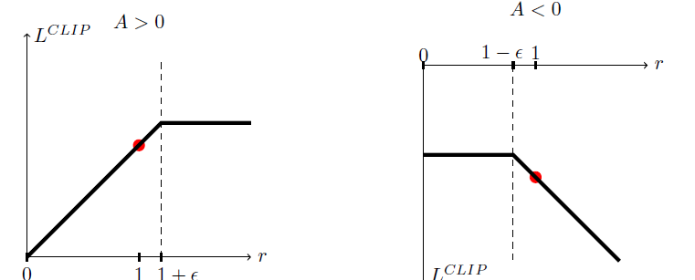

<p align="center">
    
</p>

## Introduction
The last years have brought a lot of attention to gradient policy based methods, due to modern popularity of neural network and development of auto-grad software. It can be seen by variety of new algorithms with neural network function approximation that are being introduced.

* Deep Q-Learning
* Vanilla Policy Gradient Methods
* Trust Region Policy Gradient Methods

These algorithms still have some challenges. Q-learning have been shown to fail on many tasks and is badly understood, Vanilla Policy Gradient method have poor data efficiency and not robust and TRPO is too complex.
The goal of our research article is to improve the state of affairs by giving an algorithm that has the data efficiency and reliable performance of TRPO  (Trust Region Policy Optimisation), but largely reduces the complexity of the algorithm. The authors propose two new surrogate objectives by introducing new types of regularisation and clipping . By bounding the difference between distributions after parameters update, the PPO allows to do the optimization of the policies by sampling first the trajectories of the given policy and then doing several steps of optimisation over them, which increases the data efficiency of the algorithm. 
Authors also discuss the empirical results and provide experiments.
The experiments are a comparison of the performances of various versions of previous surrogate objectives and show, that in many scenarios the clipped probability ratios performs the best. They also compare proximal policy optimization to several previous algorithms from the literature, suggesting that PPO performs significantly better on games like Atari in terms of sample efficiency.

### Main objective
The reinforcement learning algorithms are usually solving problems of estimation of optimal behaviour in the given environment. Contrary to the deep learning or machine learning approaches, where the model is learned on the accessible data base, the reinforcement learning agents learn to behave optimally by interacting with the environment they are in. Not to say that the learning from the database is impossible in RL paradigm, there are algorithms that allow to learn from fixed observations, but we are not going to discuss them in this work. 

For the given pair of position in environment e.g. state $s \in S$ and interaction with it e.g. action $a\in A$, the agent is said to follow the policy $\pi(a|s)$ if $\pi(\cdot | \cdot)$  defines the probability distribution over action space. The main goal of reinforcement learning is to create in some sense optimal $\pi$ function for this purpose, for example the characteristic of taking the certain action from given state is introduced e.g. the reward $r(a, s)$. Note that it does no have to be always positive. In many cases, the reward is set to be for example -1 to specify that the action taken is bad. Classically in many approaches the policy is optimizing the notion of action taken, for example it takes the action that will bring more reward in future in expectation. Such an approach is well developed, but is not of interest in this work.
The other way of solving the stated problem is to introduce a function that can be parametrized by set of parameters $\theta$ and next to optimize the $\theta$ to produce some optimal policy. This is motivated by recent development in the domain of neural networks and automatic differentiation, that allows to solve a wast class of optimisation problems with high precision. By specifying the differentiable by every coordinate of $\theta$, function $J(\theta)$ to be maximised, it is straight forward to use the gradient ascent algorithm, that can be written as 
$$
\theta = \theta + \alpha \nabla J(\theta).
$$
Now the challenging problem is creating the suitable function $J$ that can be efficiently computed for the simulated scenarios. The function of interest have to satisfy some mathematical constraints. It have to be easily computed and its maximisation have to lead to optimal agent for specified problem.
One of the choices is to use value function of the starting state of the algorithm $v(s_0)$. By definition $v(s)$ is given by
$$
v(s) = \sum_a \pi(a |s) q_{\pi}(a, s)
$$
where $q(s, a) = r(s, a) + \gamma^i v(s')$ is the action value function. It means basically that we want to find a strategy to act in the environment, that will bring the biggest reward if we will start playing from state $s_0$. This looks like challenging task at first, but luckily for us there are a more easy way to deal with representation of gradient of value function, given by policy gradient algorithm, which states that
$$
\nabla J \propto \sum_s \mu(s) \sum_a q_\pi (s, a) \nabla \pi(a |s, \theta)
$$
Here the $\mu$ is the distribution of being in given state under policy $\pi$. Therefore, the expression above can be rewritten as $E_\pi \left[\sum_a q_\pi (s_t, a) \nabla \pi(a |s_t, \theta)\right]$. Now, the only thing left is dealing with unknown function of $q$. One of possible approaches is for example to estimate it by some other easy to compute function $\hat{q}$. The approach of interest for this work it to introduce another expectation in the expression, rewriting it as:
$$
    \begin{aligned}
    \nabla J
    &\propto E_\pi \left[\sum_a q_\pi (s_t, a) \nabla \pi(a |s_t, \theta)\right]\\
    &=E_\pi \left[\sum_a \pi(a|s_t, \theta) q_\pi(s_t, a) \frac{\nabla \pi(a |s_t, \theta)}{\pi(a|s_t, \theta)}\right]\\
    &=E_\pi \left[E_\pi \left( q_\pi(s_t, a) \frac{\nabla \pi(a_t |s_t, \theta)}{\pi(a_t|s_t, \theta)} \right)\right]\\
    &=E_\pi \left[ q_\pi(s_t, a_t) \frac{\nabla \pi(a_t |s_t, \theta)}{\pi(a_t|s_t, \theta)}\right]\\
    \end{aligned}
$$
Now by replacing the $q(s, a) = E [G|s,a]$, where $G$ is by definition the expected return of the action $a$ taken from the state $s$, e.g. sum of all the rewards obtained during one terminated scenario, we get to the final resulting formula
$$
    \begin{aligned}
    \nabla J
    &\propto E_\pi \left[ q_\pi(s_t, a_t) \frac{\nabla \pi(a_t |s_t, \theta)}{\pi(a_t|s_t, \theta)}\right]\\
    &=E_\pi \left[ E_\pi[G_t | s_t, a_t] \frac{\nabla \pi(a_t |s_t, \theta)}{\pi(a_t|s_t, \theta)}\right]\\
    &=E_\pi \left[ G_t \frac{\nabla \pi(a_t |s_t, \theta)}{\pi(a_t|s_t, \theta)}\right]\\
    &=E_\pi \left[ \nabla \log \pi(a_t |s_t, \theta) G_t \right]\\
    \end{aligned}
$$
Here $G_t, s_t, a_t \sim \pi$ are variables sampled from observing the agent, that follows the strategy $\pi$. Even though this strategy looks wonderful, it have a downside. The function $G_t$ can be estimated only after the whole episode is played. Therefore, making the whole method episodic. The possible logical continuation is to replace $G_t$ by some estimate, that can be easily computed at the time of agent taking action to speed up and facilitate the computations. Its easy to see, that by following the definitions
$$
    \begin{aligned}
    v(s)
    &= E_\pi \left[ G_t | S = s \right]\\
    &= E_\pi \left[ R_t + \gamma G_{t+1} | S = s \right]\\
    &= E_\pi \left[ R_t + \gamma E_\pi [G_{t+1} |S = s'] | S = s \right]\\
    &= E_\pi \left[ R_t + \gamma v(s') | S = s \right]\\
    \end{aligned}
$$
Therefore, we can replace out estimate of gradient of value function by following expression 
$$
    \begin{aligned}
    \nabla J
    &=E_\pi \left[ \nabla \log \pi(a_t |s_t, \theta) G_t \right]\\
    &=E_\pi \left[ R_t +  \gamma v(s_{t+1}) \nabla \log \pi(a_t |s_t, \theta)  \right]\\
    \end{aligned}
$$
Lets also notice, that:
$$\nabla_{\theta} f(s, a) = f(s, a) \nabla \sum_a \pi(a |s, \theta)$$
Where $f(s, a)$ is any function independent of $\theta$. This observation yields an interesting result. We now can add the term to introduced expectation, without changing it
$$
E_\pi \left[ ( R_t +  \gamma v(s_{t+1}) -f(s, a))\, \nabla \log \pi(a_t |s_t, \theta)  \right]
$$
Setting the $f(s, a) = v(s)$, we obtain one of the most commonly used estimator of the desired gradient:
$$
E_\pi \left[ ( \hat{Q}(s, a) - \hat{v}(s))\, \nabla \log \pi(a_t |s_t, \theta)  \right] = E_\pi \left[\hat{A_t}(s, a)\, \nabla \log \pi(a_t |s_t, \theta)  \right] 
$$
The hat indicates that we use the approximation of the value function of any given state to compute the advantage function at time step t and expectation is replaced empirical expectation $\hat{E}$ by averaging over batch of series played by the same agent. A lot of software are using the automatic differentiation packages, and in that case it makes more sense to introduce the differentiable function which we are going to maximise by changing the $\theta$.
$$
L(\theta) = \hat{E}_\pi \left[\hat{A_t}(s, a)\, \log \pi(a_t |s_t, \theta)  \right] 
$$
This expression can be easily extended to continuous spaces of states and actions. Of course taking $J$ as a value function is one of possible choices, that yield arguably the most general approach and REINFORCE algorithm. There exists different propositions. One of disadvantages of REINFORCE and REINFORCE with baseline is that in original the update can be done only after the episod is played in backward manner. So the updates are performed once for each action-state pair in a given episode, e.g.
$$
\theta_{t+1} = \theta_{t} + \alpha G_t\frac{\nabla \pi (A_t |S_t, \theta)}{\pi (A_t |S_t, \theta)}
$$
This is a terrible estimate of expectation over the policy and can create a huge error. One may desire to take more stable version, by considering the expectation of returns over set of trajectories. For example by optimising finite-horizon undiscounted return  e.g. 
$$
 J(\theta) = E_{\tau \sim \pi} [R(\tau)] = \int  P(\tau|\theta) R(\tau)\\
$$
This approach yields well known Vanila Gradient Policy algorithm.
In this expression the probabilities over trajectories is taken, trajectory $\tau$ is chain of states and actions taken $s_0, a_0, s_1, ...$. Its easy to see, that probability of the trajectory can be described as a product of probabilities of taking successive actions and moving between states after taking them 
$$
P(\tau|\theta) = \rho(s_0) \prod_{t=0}^{T} P(s_{t+1}|s_{t}, a_{t}) \pi_{\theta}(a_{t}, s_{t})
$$
Here $\rho(\cdot)$ is distribution of initial position of the agent. Now by considering the $\nabla \log(\cdot)$ trick
$$
\nabla_{\theta} P(\tau |\theta) = P(\tau |\theta) \nabla_{\theta} \log P(\tau | \theta)
$$
we can transform
$$
    \begin{aligned}
    \nabla_{\theta} J(\theta) 
    &= \nabla_{\theta} E_{\tau \sim \pi} [R(\tau)] = \nabla_{\theta} \int  P(\tau|\theta) R(\tau)\\
    &= \int \nabla_{\theta} P(\tau|\theta) R(\tau) = \int R(\tau) P(\tau |\theta) \nabla_{\theta} \log P(\tau | \theta) \\
    &= E_{\tau \sim \pi} [ R(\tau) \nabla_{\theta} \log P(\tau | \theta) ]
    \end{aligned}
$$
But at the same time
$$
    \begin{aligned}
    \nabla_{\theta} \log P(\tau | \theta)
    &= \nabla_{\theta} \left(\log(\rho(s_0)) + \sum_{t=0}^{T} \log(P(s_{t+1}|s_{t}, a_{t})) + \log( \pi_{\theta}(a_{t}, s_{t}))\right)\\ 
    &= \sum_{t=0}^{T}  \nabla_{\theta}  \log( \pi_{\theta}(a_{t}, s_{t}))\\
    \end{aligned}
$$
This manoeuvre yields final result
$$
\nabla J(\theta) = E_{\tau \sim\pi}\left[R(\tau) \sum_{t=0}^T \frac{\nabla \pi (A_t |S_t, \theta)}{\pi (A_t |S_t, \theta)}\right]
$$
They do look very similar in objective functions, but they are different. The biggest difference probably comes from different approach to derivation of policy gradient, since in REINFORCE the expectation is taken over actions and states sampled from given distribution $\pi$ but in VPG the expectation is taken over all possible trajectories given a fixed policy. Also, the way the gradient ascent is performed differs strongly since in REINFORCE method the gradient ascent is performed once for each action taken for each episode and the direction of ascent is taken as 

$$
G_t\frac{\nabla \pi (A_t |S_t, \theta)}{\pi (A_t |S_t, \theta)}
$$
so the update becomes
$$
\theta_{t+1} = \theta_{t} + \alpha G_t\frac{\nabla \pi (A_t |S_t, \theta)}{\pi (A_t |S_t, \theta)}
$$
but in VPG algorithm the gradient ascents performed once over multiple episodes and direction of ascent taken as average

$$
\frac{1}{|\mathcal{T}|}\sum_{\tau\in\mathcal{T}} \sum_{t=0}^T R(\tau) \frac{\nabla \pi (A_t |S_t, \theta)}{\pi (A_t |S_t, \theta)}
$$

and gradient ascent step is

$$
\theta_{t+1} = \theta_{t} + \alpha \frac{1}{|\mathcal{T}|}\sum_{\tau\in\mathcal{T}} \sum_{t=0}^T R(\tau) \frac{\nabla \pi (A_t |S_t, \theta)}{\pi (A_t |S_t, \theta)}
$$
Where $\mathcal{T}$ is set of all the trajectories. In accordance with baseline trick introduced before, this objective function can too be transformed into more general version
$$
\nabla J(\theta) = E_{\tau \sim\pi}\left[ \sum_{t=0}^T \Phi_t \frac{\nabla \pi (A_t |S_t, \theta)}{\pi (A_t |S_t, \theta)}\right]
$$
where 
$$
\Phi_t = R(\tau)
$$
or
$$
\Phi_t = \sum_{t`=t}^TR(s_{t`}, a_{t`}, s_{t`+1}, a_{t`+1})
$$
or
$$
\Phi_t = \sum_{t`=t}^TR(s_{t`}, a_{t`}, s_{t`+1}, a_{t`+1}) - f(a_t, s_t)
$$
yielding family of algorithms, which average over the trajectories taken when optimising the agent's policy. We would later assume, without proving, that they are equivalent from theoretical stand point, e.g. method described for 
$$
E_{\tau \sim\pi}\left[ \sum_{t=0}^T \Phi_t \frac{\nabla \pi (A_t |S_t, \theta)}{\pi (A_t |S_t, \theta)}\right]
$$
can be equivalently deduced for 
$$
E_\pi \left[\Phi_t(s, a)\, \nabla \log \pi(a_t |s_t, \theta)  \right]
$$
and the only difference between them will be the way of computing the gradient ascent step. This meaning, either minimizing over the batch of episodes or taking each episode separately.
In Deep Learning the method of averaging over batch and performing several epochs on the same database is often utilised due to limited amount of data. In reinforcement learning paradigm the same approach is desirable. But while it is appealing to perform multiple steps of optimisation over the same trajectory, it is not justified and empirically it often leads to destructively large policy updates.
## Gradient Ascent Optimisation

### Vanilla policy gradient methods

In the last section, we saw that in the policy gradient methods, the most classical form of the gradient was 
$$
\hat{g} =  \hat{E_{t}} \left[\hat{A_t}(s, a)\, \nabla \log \pi(a_t |s_t, \theta)  \right] 
$$
Classically, we will use a stochastic gradient ascent by computing this gradient to maximize the function.
$$ LPG(\theta) = \hat{E_{t}} \left[\hat{A_t}(s, a)\, \log \pi(a_t |s_t, \theta)  \right] $$
In Algorithm we present the *Vanilla Policy Gradient* algorithm, that allows to make one of the most simple implementations of gradient ascent.
******
**Vanila Policy Gradient Algorithm**
******
1. State Input: initial policy parameters $\theta_0$, initial value function parameters $\phi_0$
2. For $k=0, 1, 2, ...$
3. Collect set of trajectories $\mathcal{D}_k = \{\tau_i\}$ by running policy $\pi_k = \pi_k(\theta_k)$ in the environment.
4. Compute rewards-to-go $\hat{R}_t$.
5. Compute advantage estimates, $\hat{A}_t$(using any method of advantage estimation) base on the current value function $V_{\phi_k}$.
6. Estimate policy gradient as 
$$
\hat{g}_k = \frac{1}{|\mathcal{D}_k|} \sum_{\tau\in\mathcal{D}_k}\sum_{t=0}^{T}\nabla_{\theta} \log \pi_{\theta}(a_t |s_t)|_{\theta_k} \hat{A}_k.
$$
\State Compute policy update, either using standard gradient ascent,
$$
\theta_{k+1} = \theta_{k} + \alpha_k \hat{g}_k,
$$
or via another gradient ascent algorithm like Adam.
7. Fit value function by regression on mean-squared error:
$$
\phi_{k+1} = \text{arg}\, \min_{\phi} \frac{1}{|\mathcal{D}_k|}\sum_{\tau\in\mathcal{D}_k}\frac{1}{T}\sum_{t=0}^{T}(V_\phi(s_t)-\hat{R}_t)^2
$$
typically via some gradient descent algorithm.
8.
******
In the *Vanilla Policy Gradient* or VPG, we start by choosing the parametrisation of $\pi_{\theta}$, by some differential function of latent parameter $\theta$. It is usually characterised by neural network. As initial guess we set the weights of neural network randomly.  Now for updating its weights in the right direction we are in need of advantage function. Which is inaccessible, but can be estimated from value functions of state. Often even the value functions of the states are out of reach and we have to estimate them too. It makes sense to use similar parametric approach (value function can be estimated by different method, but VPG classically uses neural network for estimation). We initialise Value function neural network by random values. Its easy to notice, that the value function of a given state is exactly the mean rewards gain by following the policy from its state until the end of the episode. This gives rise to estimate written in Algorithm .We will leave the question of advantage function estimation for later.  Now assuming that we have a reasonable estimation of advantage function, we can finally compute the policy gradient direction and optimise the objective function.

### Advantages and Drawbacks
In VGP, to maximize our objective function, we use the line search approach. At each step, we update the $\theta$ parameters using 

$$\theta_{t+1} = \theta_{t} + \alpha \nabla LPG(\theta)$$
Assuming the gradient of the function to maximise is known, the gradient ascent is easy to implement. However it has major drawback in the choice of the parameter $\alpha$. Just as in the gradient descent algorithm it's choice is very important to the optimisation procedure. Taking it too big can change the policy too rapidly, which will make the destructive to the policy update. This problem also arises, when during the optimisation process we are reusing the sampled trajectory multiple times, since it produces the same effect of moving in to possible wrong direction in policy space for too long. This intuition was reinforced in . In this work the authors have developed a bound for changes in estimated discounted rewards from a given state, indicating that small change in policy in steepest ascent direction will surely improve the total expected reward of the agent. This result was developed for update rule represented by mixture of two distributions, which is not of big use in the policy gradient approach we are working with. 

### From line search to trust region
The idea of small incremental changes to the policy was further developed in , by providing the bound for improvement of general update of the policy. To deal with the possible destructive step, the idea is to use the trust region approach. Further, it has been empirically proven that the critical network that determines the value function of a state is most sensitive to the weights of the network than to the policy. To summarize, a small change of $\theta$ can generate a big change of the value function V, while most of the time, a small change of $\pi_{\theta}$ generates a small change of V. In order to have a relatively stable updating process, it is thus in our interest to act directly on the policy, and to make sure that the latter does not change too much from one iteration to another. 
To be sure not to go too far in our update, we first identify the maximum step size that we allow ourselves. Then, we look for the optimal point in the considered region. Thus, in Trust Region Policy Optimization or TRPO, we limit how far we can change our policy in each iteration through restricting how much the policy will change after the gradient update.
Since policy $\pi$ defines the distribution over state, action space, it is possible to use any form of divergence between distributions. The TRPO uses the KL (Kullback-Leibler) divergence, for two discrete probability distributions $P$ and $Q$ :
$$D_{KL}(P,Q) = \sum_{x} P(x) \log(\frac{P(x)}{Q(x)})$$

We take for $P$ and $Q$ the old policy and the new policy obtained after updating the parameters.When the probability of an event $P(x)$ in $P$ is high, if the same event in $Q$ has a low probability, this creates a large KL divergence. Conversely, if the probability is low in $P$ and high in $Q$, the KL divergence is lower.
For the policies $\pi_{\theta}$ and $\pi_{\theta_\text{old}}$ not to be too far from each other, we will use the following update process:
$$
    \begin{aligned}
        \text{maximize }&\,\hat{\mathbb{E}}\left[ \frac{\pi_\theta(a_t |s_t)}{\pi_{\theta_{\text{old}}}(a_t |s_t)} \hat{A}_t \right]\\
        \text{subject to }&\,\hat{\mathbb{E}}_t [\text{KL}[\pi_{\theta_{\text{old}}}(\cdot | s_t), \pi_{\theta}(\cdot|s_t)]] \leq \delta.
    \end{aligned}
$$
We define a region in which our two policies are close according to the KL divergence, and we try to maximize our objective function in this region. 
However, classical deep learning framewors like Tensorflow and PyTorch do not allow to do optimization under constraints. It is well known, that solving such an optimisation problem is equivalent to solving problem, in which we replace the constraint by a penalty term in the function to be optimized: 
$$
\text{maximize }\,\hat{\mathbb{E}}\left[ \frac{\pi_\theta(a_t |s_t)}{\pi_{\theta_{\text{old}}}(a_t |s_t)} \hat{A}_t - \beta \, \text{KL}[\pi_{\theta_{\text{old}}}(\cdot | s_t), \pi_{\theta}(\cdot|s_t)] \right]
$$
 We have gotten ride of the problem of choosing the suitable parameter $\alpha$, but we have introduced two new parameters to be optimised $\delta, \beta$. If the difficulty in the line search methods lay in the choice of the $\alpha$ parameter, it is still complicated to choose the $\delta$ or $\beta$ parameters in the Trust Region methods. 
# Proximal Policy Optimisation

Now that we have studied the main points of our problem, by focusing on the objective functions that we want to optimize, let's focus on the added value of the article studied. This article proposes algorithms to solve the problems identified in the previous part, namely the choice of the hyper-parameters of the gradient ascent, $\alpha$, $\beta$ and $\delta$.
We will study the *Clipped Surrogate Objective* and *Adaptive KL Penalty* methods which represent efficient ways to optimize our objective function.
### Clipped Surrogate Objective
The gradient policy methods are optimising common surrogate objective function, either with or without constraints
$$
L^{CPI}(\theta) = \hat{E}_{t}\left[\frac{\pi_{\theta}(a_t|s_t)}{\pi_{\theta_{old}}(a_t|s_t)} \hat{A}_t\right]
$$
By introducing new function
$$
r_t(\theta) = \frac{\pi_{\theta}(a_t|s_t)}{\pi_{\theta_{old}}(a_t|s_t)}
$$
We can write
$$ 
 L^{CPI}(\theta) = \hat{E}_{t}\left[\frac{\pi_{\theta}(a_t|s_t)}{\pi_{\theta_{old}}(a_t|s_t)} \hat{A}_t\right] = \hat{E_{t}}[r_t(\theta) \hat{A}_t] 
$$
With these notations, we have $r_t(\theta_{old}) = 1$. So, to avoid having too large updates that would lead to an unstable optimization, we have to have $r_t(\theta)$ close to $1$ at each policy iteration. To achieve that, for example in TRPO the penalty term in form of KL divergence is introduced, in new algorithm for that reason the Clipped Surrogate Objective is used. The new function to be optimized is: 

$$
L^{CLIP}(\theta) = \hat{E_{t}}\left[\min(r_t(\theta) \hat{A_t}, \text{clip}(r_t(\theta), 1-\epsilon, 1+\epsilon)\hat{A_t})\right]
$$
where for $a \leq b$
$$
\text{clip}(x,a,b) = 
\left\{ 
    \begin{array}{ll}
        x & \text{if } x \leq a \And x \geq b \\
        a  & \text{if } x > a   \\
        b  & \text{if } x < b
    \end{array}
\right.
$$

Thus, if the expected ratio between the new policy and the old policy falls outside the range $1 - \epsilon$ and $1 + \epsilon$, the $r_t$ will be clipped.  This discourages large policy change if it is outside of small region, surrounding 1. Which represents, no changes at all. Finally, we take the minimum of the clipped and unclipped objective, so the
final objective is a lower bound (i.e., a pessimistic bound) on the unclipped objective.
The way the clip is realized depends on the sign of $\hat{A_t}$, as can be seen in the following figure. 

<p align="center">
    
</p>


### Adaptive KL Penalty Coefficient

The paper also deals with another approach of Proximal Policy Optimization, very close to the TRPO approach seen previously. We have seen that in this last method, the main problem resides in the choice of the parameter $\beta$. This parameter $\beta$ controls the importance of the penalty. If $\beta$ is large, we will be wary of changing the policy too much, and will restrict the area in which we search for our new policy. On the contrary, if $\beta$ is smaller, we are more lax, and we allow a bigger change of policy.  
The Adaptive KL Penalty Coefficient method proposes a dynamic way to manage this $\beta$ parameter over the iterations.
1. Using several epochs of minibatch SGD, optimize the KL-penalized objective
    $$
        L^{\text{KLPEN}}(\theta) = \hat{\mathbb{E}}_t \left[ \frac{\pi_{\theta}(a_t|s_t)}{\pi_{\theta_{\text{old}}}(a_t|s_t)}\hat{A}_t - \beta \text{KL} [\pi_{\theta_{\text{old}}} (\cdot|s_t), \pi_{\theta}(\cdot | s_t)] \right]
    $$
2. Compute $d=\hat{\mathbb{E}}_t [\text{KL} [\pi_{\theta_{\text{old}}} (\cdot|s_t), \pi_{\theta}(\cdot | s_t)]]$
    
3. if $d\leq d_{\text{targ}}/1.5, \beta \xleftarrow[]{} \beta/2 $
4. if $d > d_{\text{targ}}/1.5, \beta \xleftarrow[]{} 2\beta $


Here we just have to choose a $d_{\text{targ}}$, which is the deviation that we allow ourselves to have between the policies $\theta_{\text{old}}$ and $\theta_{new}$. If for an iteration, the effective deviation is much lower $d_{\text{targ}}$, we can allow ourselves to be a little more lax and therefore decrease $\beta$. On the contrary, if the effective deviation is much larger, we must be stricter and increase $\beta$.
The parameters 1.5 and 2 have been chosen empirically but the algorithm is not very sensitive to them. There remains the question of the initialization of $\beta$. But whatever the initialization, the algorithm adapts very quickly and tends towards an $\beta_{\text{optimal}}$.


### Proposed Algorithm and bias-variance tradeoff

After defining the strategies of 'Clipped Surrogate Objective' and 'Adaptive KL Penalty', the studied paper proposes us the following PPO algorithm : 
******
*PPO, Actor-Critic Style*
******
1. For Iteration=0, 1, 2, ...
2. For actor=0, 1, 2, ...N
    1. Run policy $\pi_{\theta_\text{old}}$ in environment for $T$ time steps
    2. State Compute advantage estimates $\hat{A}_1, .., \hat{A}_T$
3. Optimize surrogate $L$ with respect to $\theta$, with $K$ epochs and minibatch size $M <  NT$
4.  $\theta_{\text{old}}\xleftarrow[]{} \theta$
******

This algorithm uses fixed-length trajectory segments, ie we runs the policy for T time steps and uses the collected samples for an update.  
The estimator of the advantage function is : 

$$\hat{A_t} = \delta_t + (\gamma \lambda)\delta_{t+1} + ...(\gamma \lambda)^{T-t+1}\delta_{T-1} \\ $$

where $$\delta_t = r_t + \gamma V(s_{t+1})= - V(s_t)$$

Lets notice, that $\hat{A}=\delta_t$ is a unbiased estimate of $A$ in a sense, that 
$$
E_{s_{t+1}}[r_t + \gamma V(s_{t+1}) - V(s_t)] = E_{s_{t+1}}[Q(a_t, s_t) - V(s_t)] = A(a_t, s_t)
$$
Here we abuse the fact, that $V(s)$ is known, but in reality we know only its approximation, so the bias of estimator will be correlated to error of estimation of $V$ by  $V_\theta(s)$. By increasing the trajectory we can minimise the impact of $V_\theta(s_{t+1})$, lets write
$$
 \begin{aligned}
&\hat{A}_t^{(1)}:=\delta^V_t& =r_t + \gamma V(s_{t+1}) - V(s_t) \\
&\hat{A}_t^{(2)}:=\delta^V_t + \gamma\delta^V_{t+1}&=r_t + \gamma r_t + \gamma^2V(s_{t+2}) - V(s_t)\\
&\hat{A}_t^{(3)}:=\delta^V_t + \gamma\delta^V_{t+1}+\gamma^2\delta^V_{t+2}&=r_t + \gamma r_t + \gamma^2r_{t+2}+\gamma^3V(s_{t+3}) - V(s_t)\\
&...&\\
&\hat{A}_t^{(\infty)} := \sum_{i=0}^{\infty} \gamma^i\delta_{t+i}^{V}
 \end{aligned}
$$
The longer the traction, the smaller the term $\gamma^i$ at $V(s_{t+i})$, therefore the approximation of advantage function is less biased .
It, however, is not perfect, since the variance is increasing with longer path, e.g. $\hat{A}^{(1)}_t$ has low variance and high bias, and $\hat{A}^{(\infty)}_t$ has low bias, but high variance. The tradeoff can be introduced by taking some $i < \infty$ and estimating the A by $\hat{A}^{(i)}_t$. But choice of $i$ is not evident. By analogy of generalisation for TD($\lambda$), the other way to introduce the trade-off between bias and variance is to take a weighted sum. In practical case, of course the infinite trajectories are not accessible. So the trajectories of length T are taken into account, which results exactly in
$$
\hat{A}_t = \sum_{i=0}^{T-(t+1)} (\gamma \lambda)^i \delta^{V_\theta}_{t + i}
$$
Where $\lambda$ introduces trade off between bias and variance of advantage function estimation.
To understand the interest of such an estimator, we must first look at the famous bias-variance tradeoff of the estimates. In a reinforcement learning algorithm, we do not know the target, the objective function, but we make an estimate of it that we try to improve over time.  Our estimate for the same state changes as we keep on learning. If the variance increases, we will not be able to predict the output of an unseen data with precision. But on the other hand, if the bias increases, our predictions will be incorrect. 
\newpage 
# Performances comparison

After presenting the mathematical aspects of the proposed new method, our paper focuses on the performance of the algorithm studied in section.
Before implementing our own experiments, let us summarize the performances obtained by the authors of our paper. 
These experiments are divided into 3 parts : 
1. Comparison of Surrogate Objectives
2. Comparison to Other Algorithms in the Continuous Domain
3. Comparison to Other Algorithms on the Atari Domain

### Comparison of Surrogate Objectives

The very first objective of the experiments carried out was to find the best version of the objective function L. In fact we saw that there were several versions of our surrogate L, namely $L^{PG}$, $L^{CLIP}$ or $L^{KLPEN}$. In addition to testing these different versions, it is also a question of tuning their hyperparameters: the $\epsilon$ of $L^{CLIP}$, the $\beta$ of  $L^{KLPEN}$, or the $d_{targ}$ in the case of an adaptive $\beta$ parameter.
A large number of tests are needed to do this tuning, hence the need to work with low-cost tasks. 
The MuJoCo physics engine, implemented in Python in the OpenAI Gym library represents a good solution for this use case. Seven relatively simple tasks of this robot were chosen to tune the hyperparameters, among which InvertedPendulum, Walker2d and Swimmer. 
To represent the policy, they used a fully-connected MLP with two hidden layers of 64 units, and tanh nonlinearities, outputting the mean of a Gaussian distribution, with variable standard deviations.
Each of the selected surrogate objectives has been tested 3 times in the 7 different environments of MuJoCo, and here are the results obtained :

| algorithm | avg.normalized score |
|-----------|----------------------|
| No clipping or penalty | -0.39 |
|Clipping, $\epsilon = 0.1$ | 0.76|
| *Clipping*, $\epsilon=0.2$ | *0.82*|
|Clipping, $\epsilon = 0.3$ | 0.70|
|Adaptive KL $d_{\text{targ}} = 0.0003$ | 0.68|
|Adaptive KL $d_{\text{targ}} = 0.001$ | 0.74|
|Adaptive KL $d_{\text{targ}} = 0.003$ | 0.71|
|Fixed KL $\beta = 0.3$ | 0.62|
|Fixed KL $\beta = 1$ | 0.71|
|Fixed KL $\beta = 3$ | 0.72|
|Fixed KL $\beta = 10$ | 0.69|


We can see that the best performances are obtained with $L^{CLIP}$ and an $\epsilon$ value of 0.2. 
In this table, we can also see that the results obtained with $L^{KLPEN}$ are better when using an adaptive $\beta$ penalty parameter, than with a fixed $\beta$, even if the results obtained are relatively close. 
Thus, the version of our PPO that we will retain in the rest of this experimental part, and that we will then compare with other algorithms of the literature, is the one  with the objective surrogate $L^{CLIP}$ and $\epsilon = 0.2$.

### Comparison to Other Algorithms in the Continuous Domain

Let us now see how the PPO presented in our paper performs on its 7 continuous tasks compared to other algorithms found in the literature. The comparison is done with 5 methods: A2C, A2C + Trust Region, Vanilla PG, CEM and TRPO. 


<p align="center">
    
</p>


This figure shows us the efficiency of the PPO, which is always among the best performing algorithms when it is not the best itself. 

### Comparison to Other Algorithms on the Atari Domain

In our paper, a comparison with other tasks a little more complex and gamified is also made, namely the 49 Atari games available in OpenAIGym. In this experiment, the authors compare the performances of PPO with those of A2C and ACER in games of these 49 games. The results are as follows:

| A2C | ACER | PPO | Tie |
|-----|------|-----|-----|
|(1) avg.episode reward over all of training | 1 | 18 | 30 | 0 | 
|(2) avg.episode reward over last 100 episodes | 1 | 28 | 19 | 1 |


We can see that our algorithm is the best when we look at the reward obtained on the whole training phase, on our 49 games. But when we only look at the last 100 episodes, the ACER algorithm wins in most games. This means that our PPO algorithm favors a very fast training, while ACER favors the final performance.

# Implementations


The goal of this experimental part is to understand, step by step, how to code our PPO from scratch in python. 
Not really knowing where to start, we looked at the existing codes already on GitHub. We then came across the PPO-for-Beginners repo, created by Eric Yu. He has developed a repo consisting of 5 python files, which code PPO from Scratch with PyTorch. Here is the link of the [repo](https://github.com/ericyangyu/PPO-for-Beginners).
He adds to his code three Medium articles, where he explains step by step and in a very intuitive way the different steps of its implementation. 
Rather than starting from scratch, we decided to focus on this repo, and on these 3 articles, in order to understand in detail the way Eric Yu implemented PPO. 
In Python, it's important to know how to code, but it's also important to know how to read and understand a code written by someone else, which is why we decided to do this. This part is therefore intended to briefly explain the code present in this repo, as well as to present the experiments we have done with it. 
The latter has chosen to implement the variant PPO-clip, whose pseudo-code is as follows :

******
*PPO-Clip*
******
1. Input: initial policy parameters $\theta_0$, initial value function parameters $\phi_0$
2. For k=0, 1, 2, ...
3. Collect set of trajectories $\mathcal{D}_k = \{\tau_i\}$ by running policy $\pi_k = \pi_k(\theta_k)$ in the environment.
4. Compute rewards-to-go $\hat{R}_t$.
5. Compute advantage estimates, $\hat{A}_t$(using any method of advantage estimation) base on the current value function $V_{\phi_k}$.
6. Update the policy by maximizing the PPO-Clip objective :
$$
\theta_{k+1} = \text{arg}\, \max_{\theta} \frac{1}{|\mathcal{D}_k|}\sum_{\tau\in\mathcal{D}_k}\frac{1}{T} \sum_{t=0}^{T}\min(\frac{\pi_{\theta}(a_t |s_t)}{\pi_{\theta_k}(a_t |s_t)} A^{\pi_{\theta_k}}(s_t, a_t), g(\epsilon, A^{\pi_{\theta_k}}(s_t, a_t)))
$$ 
typically via stochastic gradient ascent with Adam
7. Fit value function by regression on mean-squared error:
$$
\phi_{k+1} = \text{arg}\, \min_{\phi} \frac{1}{|\mathcal{D}_k|}\sum_{\tau\in\mathcal{D}_k}\frac{1}{T}\sum_{t=0}^{T}(V_\phi(s_t)-\hat{R}_t)^2
$$
typically via some gradient descent algorithm.


This algorithm includes 7 steps that we will study one by one.
Here is the first one : 


**1: Input: initial policy parameters $\theta_0$, initial value function parameters $\phi_0$**
It consists in initializing the actor and critic networks. This is done in a simple way using neural networks from the pytorch library. The only challenge is to adapt the dimensions of the inputs/outputs of the networks to the different environments in which we work. 


**2 : For $k=0,1,2,...$**
Step 2 consists only in creating a loop, and therefore in choosing a parameter total\_timesteps, which will define the number of steps we will perform in our training. This parameter is fixed at 200 000 000 but we can kill the training process whenever we want.


**3 : Collect set of trajectories $\mathcal{D}_k = \{\tau_i\}$ by running policy $\pi_k = \pi_k(\theta_k)$ in the environment.**
Step 3 consists in collecting data from a set of episodes by running our current actor policy, and keeping in memory the information we will need for the following computations, namely observations, actions, log probs of each action, batch rewards, batch rewards-to-go and episodic lengths in batch
The line of code env.reset() allows to reset our envionment between two episodes. 
Remember that the chosen actions must be taken from our policy. It is the actor network that allows us to choose our new action at each step. To keep a part of exploration, the author uses a MultivariateNormal. The actor network will output the mean action to choose, and this distribution, centered on this mean action, will allow to choose an action close to this action coming from the actor network. 


**4 : Compute rewards-to-go $\hat{R}_t$.**
It is simply a question of using the formula to have our rewards-to-go, knowing that we have kept in memory the different rewards obtained along our trajectories. 
The author decides to set gamma to 0.95. Remind that the formula of the rewards-to-go is : $\hat{R}(s_k) = \sum_{i=k}^T \gamma^{i-k} R(s_i)$.


**5 : Compute advantage estimates, $\hat{A}_t$(using any method of advantage estimation) base on the current value function $V_{\phi_k}$.**
Step 5 consists in computing the advantage function At, defined by the formula : $A^{\pi}(s,a) = Q^{\pi}(s,a) - V_{\phi_k}(s)$
where $Q^{\pi}$ is the Q-value of state action pair (s, a), and $V_{\phi_k}$ is the value of some observation s determined by our critic network following parameters $\phi$ on the k-th iteration. This calculation takes a few lines of code, knowing that we have retained the values of $A$ along our trajectories, and that $V$ is easily obtained by evaluating our critic network.


**6 : Update the policy by maximizing the PPO-Clip objective :**
$$
\theta_{k+1} = \text{arg}\, \max_{\theta} \frac{1}{|\mathcal{D}_k|}\sum_{\tau\in\mathcal{D}_k}\frac{1}{T} \sum_{t=0}^{T}\min(\frac{\pi_{\theta}(a_t |s_t)}{\pi_{\theta_k}(a_t |s_t)} A^{\pi_{\theta_k}}(s_t, a_t), g(\epsilon, A^{\pi_{\theta_k}}(s_t, a_t)))
$$
**typically via stochastic gradient ascent with Adam**
The objective of step 6 is to update the parameters of our actor network. This is the heart of our PPO. Here, the author of the code has decided to use the clip, as seen in part 4.1.
The bottom set of log probs will be with respect to parameters 0 at the k-th iteration (which we already have with batch\_log\_probs), while the top is just at the current epoch, easy to evaluate. The advantage function was calculated in the previous step. And concerning the clip, the torch.clamp function allows to do it easily. As recommended in our paper, the epsilon parameter of the clip is set to 0.2 (see part 5.1).
Once these calculations are done, the backpropagation is done with the Adam optimizer, with a learning rate fixed at 0.005. 


**7 : Fit value function by regression on mean-squared error:**
$$
\phi_{k+1} = \text{arg}\, \min_{\phi} \frac{1}{|\mathcal{D}_k|}\sum_{\tau\in\mathcal{D}_k}\frac{1}{T}\sum_{t=0}^{T}(V_\phi(s_t)-\hat{R}_t)^2
$$
**typically via some gradient descent algorithm.**
Only the final step, step 7, remains to be coded. We know the predicted values at the current epoch, $V_\phi(s_t)$, with rewards-to-go. A simple calculation of the MSE, with the function nn.MSELoss(), as well as a new backproagation on the parameters of our critical network allows us to make this update.
These 7 steps have been implemented in the python files network.py and ppo.py. The main.py file allows to train the ppo model, by choosing the environment, and to proceed to the train/test phase. 
The author of this repo has made it very easy to train and test on the environments provided in gym, like Pendulum-v0 or BipedalWalker-v3, which allowed us to do our own tests locally on our machines. 


# Conclusion
The PPO article proposes the novel way to optimise the value function of agent with policy parameters by differential function. It improves on previously proposed method Trust Region Policy Optimisation, by utilising clipping of the gradient as a way to enforce closeness between distributions. This provides the possibility to re-utilise the batched sampled data multiple times, which strongly improves the data efficiency of TRPO, but keeps its reliable performance. Also the article proposes the answer to one of the problems with choice of hyper parameter, representing the impact of Kullback Leiber divergence between two policies in the loss function. Its does in automatic manner, improving on the TRPO method.
We saw that in terms of performance, PPO performs significantly better in the continuous domain, and in games like Atari in terms of sample efficiency (especially in terms of fast training).

This is the fork of the reposetory made by Eric Yu. 

## Usage

To train from scratch:
```
python main.py
```

To test model:
```
python main.py --mode test --actor_model ppo_actor.pth
```

To train with existing actor/critic models:
```
python main.py --actor_model ppo_actor.pth --critic_model ppo_critic.pth
```
## Results

Please refer to Eric Yu [Medium article](https://medium.com/@eyyu/coding-ppo-from-scratch-with-pytorch-part-1-4-613dfc1b14c8).
